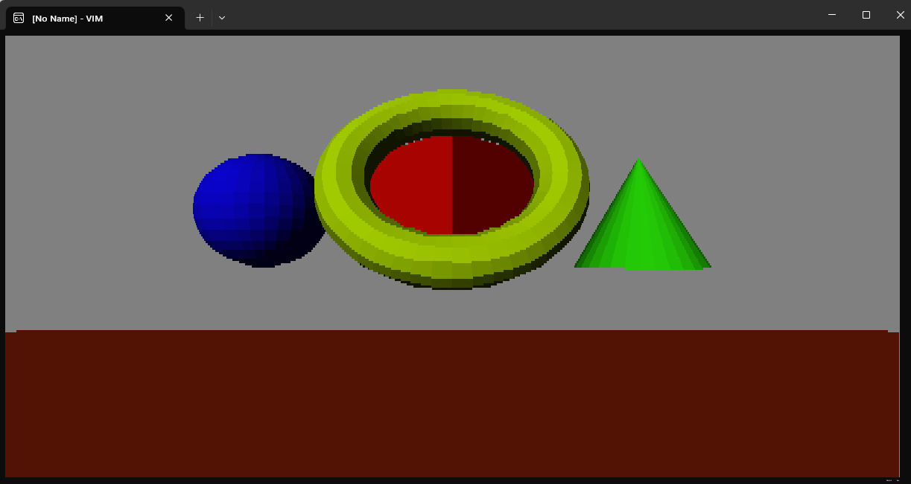

# VimSoftwareRasterizer
3D software rasterizer running in Vim

# Installation
- Copy the contents of the repo's autoload directory to ~/.vim/autoload/
- Copy the contents of the repo's plugin directory to ~/.vim/plugins/
- Start using :VimRasterizer command

# Controls
- W, A, S, D - move camera front, left, back, right
- Q, E - move camera up, down
- I, J, K, L - rotate camera
- R - switch to wireframe mode
- ESC - exit program
